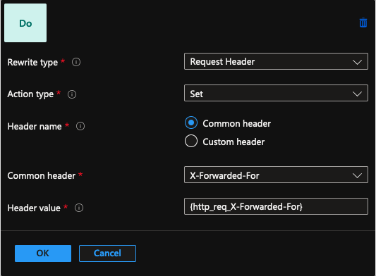
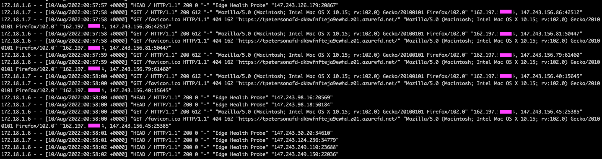
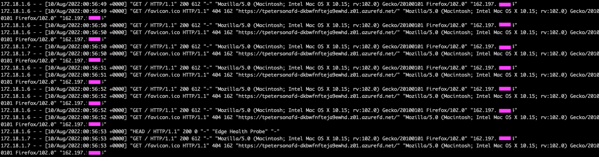

# Azure Front Door before Application Gateway X-Forwarded-For

When adding an Azure Front Door before an Application Gateway, its immportant to track the real client IP address so that downstream firewalls and applications can use that information. The Azure Front Door does provide an X-Forwarded-For header for all backend requests, here is a full list of headers supported by Azure Front Door <https://docs.microsoft.com/en-us/azure/frontdoor/front-door-http-headers-protocol>. The Application Gateways also provides its own headers similar to Azure Front Door, however, by default, Azure Application Gateway will overwrite the headers with the new information. Here is a list of headers supported by Application Gateway <https://docs.microsoft.com/en-us/azure/application-gateway/rewrite-http-headers-url>. This is problematic when another reverse proxy is deployed in front of the Application Gateway.

To keep the X-Forwarded-For header intact from the Azure Front Door through the Application Gateway, a rewrite rule must be deployed on the Application Gateway and attached to the applicable rules. 



This rule can be added to an existing rewrite set or a new rewrite set. For this, I take the rewrite type of `Request Header` and select the `Set` action to set the header value. I choose the `Common Header` option and select the `X-Forwarded-For` `Common Header` from the drop down list. From there, I set the header value to `{http_req_X-Forwarded-For}` which is a variable within App Gateway of the value of the previous request headers `X-Forwarded-For` header. In this case, it is the value of the header coming from Azure Front Door. 

There is another option, which is to add the App Gateways X-Forwarded-For value to the chain, which can be used in some cases to get the real values from multiple reverse proxies in the traffic flow. This can be done by setting the value to `add_x_forwarded_for_proxy`. The result would be something like `IP1, IP2, IP3`. This is documented in the App Gateway link above.

Here is an example using nginx as a web server with the following traffic flow: Azure Front Door -> Azure Application Gateway -> Virtual Machine running NGINX.

Here is a screenshot BEFORE adding the Application Gateway Rewrite Set:



You can see from the log that the default behavior of Application Gateway is to append the X-Forwarded-For header with the value from the upstream proxy. In the logs, you can see the request is coming from the `172.18.1.x` IP address, which the Application Gateway. The X-Forwarded-For value in this case is `162.197.xxx.xxx, 147.243.156.86:xxxx`. The first IP address is the IP address of my test server, the second IP address is the public IP address of the Azure Front Door backend, with the source port.

Here is a screenshot AFTER adding the Application Gateway Rewrite Set:



Here is this screenshot, you can see the value of the X-Forwarded-For header is set to `162.197.xxx.xxx`, which is just the test server IP address. The traffic was hitting the ssame endpoint and the traffic is still actually coming from the Application Gateway backend pool.

Here is the nginx configuration if you want to test this yourself. Its mostly just the base config adding the Log Format settings.

```config
user www-data;
worker_processes auto;
pid /run/nginx.pid;
include /etc/nginx/modules-enabled/*.conf;

events {
	worker_connections 768;
	# multi_accept on;
}

http {
	sendfile on;
	tcp_nopush on;
	tcp_nodelay on;
	keepalive_timeout 65;
	types_hash_max_size 2048;

	include /etc/nginx/mime.types;
	default_type application/octet-stream;

	ssl_protocols TLSv1 TLSv1.1 TLSv1.2 TLSv1.3; # Dropping SSLv3, ref: POODLE
	ssl_prefer_server_ciphers on;

    log_format  main '$remote_addr - $remote_user [$time_local] "$request" ' # added to test x-forwarded-for
                    '$status $body_bytes_sent "$http_referer" '
                    '"$http_user_agent" "$http_x_forwarded_for"';


	access_log /var/log/nginx/access.log main; # added to test x-forwarded-for
	error_log /var/log/nginx/error.log;

	gzip on;

	include /etc/nginx/conf.d/*.conf;
	include /etc/nginx/sites-enabled/*;
}

```

Once the config at `/etc/nginx/nginx.conf` is updated, you can restart nginx with `sudo systemctl restart nginx`, verify the service is running using `sudo systemctl status nginx`. The logs will be outputed to the default directory of `/var/log/nginx/access.log` follow the logs in real time using `tail -f /var/log/nginx/access.log`.
